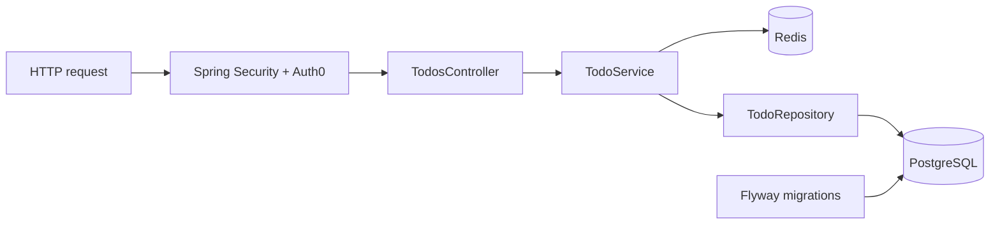

# Spring Todo API · A small API with real ownership boundaries

[](https://github.com/aranlucas/spring-todo-api/actions/workflows/ci.yml)
[](LICENSE)

Spring Todo API is a small authenticated Spring Boot REST service for personal
todo records. Auth0/OIDC supplies the user identity, PostgreSQL stores the
durable records, Redis caches individual reads, and Flyway owns schema changes.
Every todo query and mutation is scoped to the authenticated user's email.

> **The ownership test:** sign in, create a todo, read it back, then try the
> same URL as another user. The resource boundary is part of the API contract,
> while Redis keeps repeat reads light.

<p align="center">
  
</p>

## Run locally

Copy the example configuration, provide PostgreSQL, Redis, and Auth0 values, then start the app:

```shell
cp dev.properties.example dev.properties
./gradlew bootRun
```

The API is available at `http://localhost:8080`; its readiness endpoint is `/actuator/health/readiness` and Swagger UI is at `/swagger-ui.html`.

`dev.properties.example` expects:

| Variable | Purpose |
| --- | --- |
| `SPRING_DATASOURCE_URL`, `SPRING_DATASOURCE_USERNAME`, `SPRING_DATASOURCE_PASSWORD` | PostgreSQL connection. |
| `REDIS_URL` | Redis connection for per-todo caching. |
| `AUTH0_CLIENT_ID`, `AUTH0_CLIENT_SECRET`, `AUTH0_ISSUER_URI` | OIDC login and principal validation. |

Keep the copied `dev.properties` file ignored and put production values in the
hosting platform's secret store.

## Verify

```shell
./gradlew clean check bootJar
```

See [API usage](docs/api.md), [architecture](docs/architecture.md), and [operations](docs/operations.md) for details. Keep credentials in the ignored `dev.properties` file or platform-managed environment variables.

## API surface

All todo operations require an authenticated browser session or valid session
cookie. The current controller exposes:

```text
GET    /todos             paginated todos for the signed-in user
POST   /todos             create a todo; ownership comes from OIDC
GET    /todos/{id}        read one owned todo
DELETE /todos/{id}        delete one owned todo
```

Swagger UI and the generated OpenAPI document are public for discovery, while
the todo routes remain protected. A missing todo and another user's todo both
return not found, so the API does not disclose ownership.

## Architecture



The package layout and ownership checks are documented in
[docs/architecture.md](docs/architecture.md). `TodoApplicationTests` also
verifies the Spring Modulith module arrangement. `open-in-view` is disabled so
database work stays inside service transactions.

## Deployment and status

The repository includes Railway/Nixpacks deployment metadata. Use the
[operations guide](docs/operations.md) to provision PostgreSQL, Redis, and
Auth0, then check `/actuator/health/readiness` after deployment. The service is
an intentionally small modular monolith; it has no public todo UI and no
authorization beyond the OIDC session boundary.
