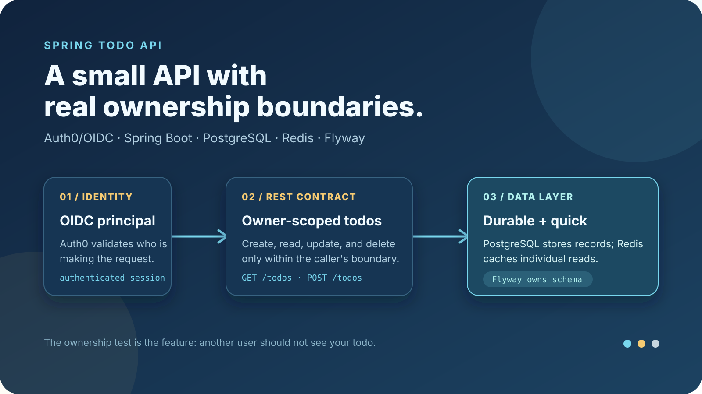
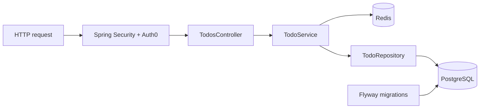

# Spring Todo API · A small API with real ownership boundaries

[](https://github.com/aranlucas/spring-todo-api/actions/workflows/ci.yml)
[](LICENSE)

Spring Todo API is a small authenticated Spring Boot REST service for personal
todo records. Auth0/OIDC supplies the user identity, PostgreSQL stores the
durable records, Redis caches individual reads, and Flyway owns schema changes.
Every todo query and mutation is scoped to the authenticated user's email.

> **The ownership test:** sign in, create a todo, read it back, then try the
> same URL as another user. The resource boundary is part of the API contract,
> while Redis keeps repeat reads light.

<p align="center">
  
</p>

## Run locally

Use Java 21, Make, and Node.js 24 or newer. Install [Portless](https://github.com/vercel-labs/portless/tree/v0.15.7), copy the example configuration, and provide PostgreSQL, Redis, and Auth0 values:

```shell
npm install -g portless@0.15.7
cp dev.properties.example dev.properties
make dev
```

The API is available at `https://spring-todo-api.localhost`; its readiness endpoint is `/actuator/health/readiness` and Swagger UI is at `/swagger-ui.html`.

`dev.properties.example` expects:

| Variable | Purpose |
| --- | --- |
| `SPRING_DATASOURCE_URL`, `SPRING_DATASOURCE_USERNAME`, `SPRING_DATASOURCE_PASSWORD` | PostgreSQL connection. |
| `REDIS_URL` | Redis connection for per-todo caching. |
| `AUTH0_CLIENT_ID`, `AUTH0_CLIENT_SECRET`, `AUTH0_ISSUER_URI` | OIDC login and principal validation. |

Keep the copied `dev.properties` file ignored and put production values in the
hosting platform's secret store.

### Local URLs and direct development

`make dev` runs the existing Gradle `bootRun` task through Portless. The
`server.port: ${PORT:8080}` setting receives the assigned port, and
`--no-daemon` keeps that environment scoped to the Gradle invocation.
Use `make dev-direct` for the original `./gradlew bootRun` behavior at
`http://localhost:8080`.

For OIDC login, register the exact callback
`https://spring-todo-api.localhost/login/oauth2/code/auth0` in your development
Auth0 application. Use the printed hostname for a Git worktree or custom proxy
configuration; callbacks are exact URLs. PostgreSQL and Redis continue using
their configured connections.

Portless starts a shared HTTPS proxy and may request local administrator access on
first use to bind port 443 and trust its development certificate. Use the URL it
prints if your proxy uses a custom port or domain. Stop the command with Ctrl+C;
`portless doctor` checks local proxy, certificate, and DNS setup.

## Verify

```shell
./gradlew clean check bootJar
```

See [API usage](docs/api.md), [architecture](docs/architecture.md), and [operations](docs/operations.md) for details. Keep credentials in the ignored `dev.properties` file or platform-managed environment variables.

## API surface

All todo operations require an authenticated browser session or valid session
cookie. The current controller exposes:

```text
GET    /todos             paginated todos for the signed-in user
POST   /todos             create a todo; ownership comes from OIDC
GET    /todos/{id}        read one owned todo
DELETE /todos/{id}        delete one owned todo
```

Swagger UI and the generated OpenAPI document are public for discovery, while
the todo routes remain protected. A missing todo and another user's todo both
return not found, so the API does not disclose ownership.

## Architecture



The package layout and ownership checks are documented in
[docs/architecture.md](docs/architecture.md). `TodoApplicationTests` also
verifies the Spring Modulith module arrangement. `open-in-view` is disabled so
database work stays inside service transactions.

## Deployment and status

The repository includes Railway/Nixpacks deployment metadata. Use the
[operations guide](docs/operations.md) to provision PostgreSQL, Redis, and
Auth0, then check `/actuator/health/readiness` after deployment. The service is
an intentionally small modular monolith; it has no public todo UI and no
authorization beyond the OIDC session boundary.

### Integration checks

The default test suite uses the real HTTP/security filters, service proxies,
repository, and production Flyway migration with H2 in PostgreSQL mode and a
local in-memory cache. OIDC principals are supplied by Spring Security's test
support; tests do not contact Auth0. The test profile extends the production
configuration rather than replacing it, and Hibernate validates the migrated
schema instead of creating it.

To exercise the same HTTP contracts against disposable local PostgreSQL and
Redis instances (Docker is not required):

```shell
TEST_DATABASE_URL=jdbc:postgresql://localhost:5432/todo_test \
TEST_DATABASE_USERNAME=todo_test \
TEST_DATABASE_PASSWORD=local-test-only \
TEST_CACHE_TYPE=redis \
TEST_REDIS_URL=redis://localhost:6379/15 \
./gradlew test --tests '*TodosHttpIntegrationTests' --rerun-tasks
```

Use an empty, dedicated test database and Redis database: the suite migrates the
database, deletes todo rows, and clears the `todos` cache between tests. With
Redis enabled, it also verifies the production ten-minute TTL configuration;
the cached HTTP reads exercise Redis value serialization and owner-scoped keys.
